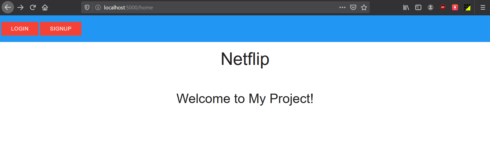
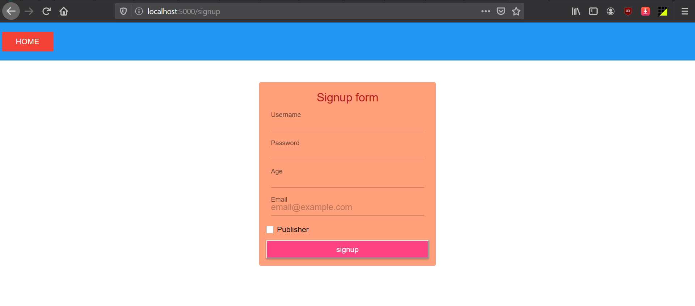
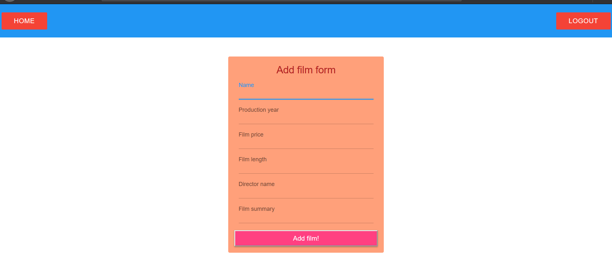
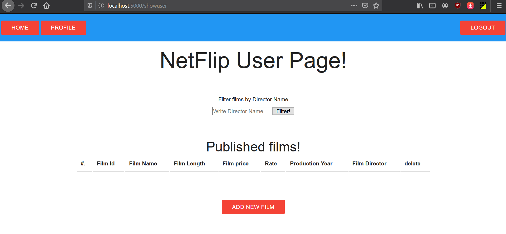
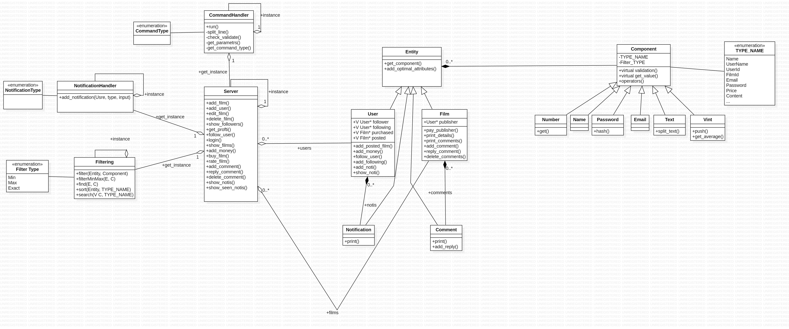

# Netflip
Final Project of Advanced Programming Course Spring98 

## Description

In this project, we should develop a web application for movie site which handles users management, adding and deleting movies, buying movies, searching movies, presenting movie details, movie recommendation and many more.  
More details of each phase are available in utility/PhaseX-Description.pdf.  
Final Code of each phase are available in archive folder  

## Implementation

At phase 1 and 2, we implemented an application to handle different queries in C++. Schematic view of design of project is available in utility/Diagram.jpg.  
At phase 3, we added html/css(mui) to project and used APHTTP framework.  
It is possible that I refactor and clean code the project with my current knowledge.  

## Usage

make 
./Netflip.out [Port = 5000]

## Testing 

Only can be used for phase 1 and 2.

./tester.sh
